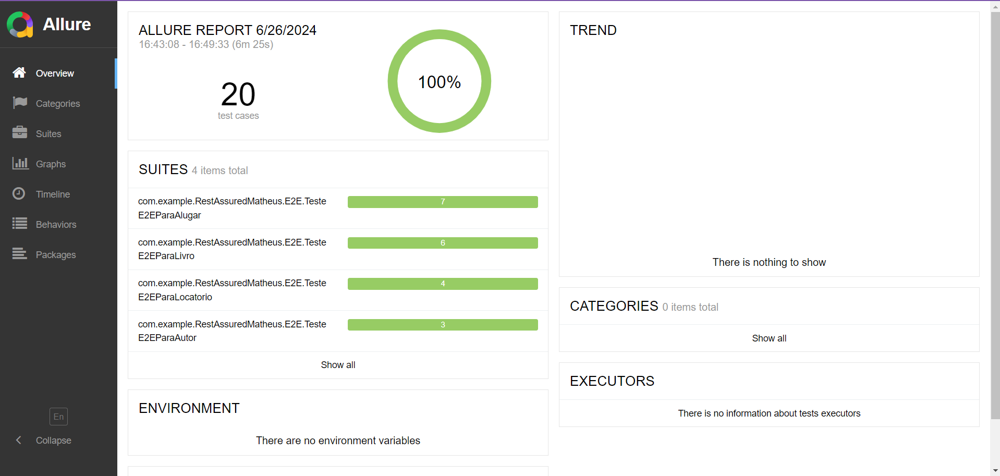

# TesteE2E


## Descrição

Este projeto realiza testes automatizados E2E da aplicação biblioteca https://github.com/Mateusun1/LivrariaApi


## 1. Pré-requisitos

- Java 17
- Gradle
- Git

## 2. Clonar o Repositório

1. Clone o repositório:
    ```bash
    git clone https://github.com/Lucca08/TesteE2E.git
    cd TesteE2E
    ```

## 3. Dependências

As dependências utilizadas neste projeto são:

- `org.springframework.boot:spring-boot-starter-web`
- `org.projectlombok:lombok`
- `org.springframework.boot:spring-boot-starter-test`
- `org.junit.platform:junit-platform-launcher`
- `io.rest-assured:rest-assured:5.3.2`

## 4. Cenários de Testes

[CenariosDeTeste](CenariosDeTeste.md)

## 5. Rode os testes 

1. Comando para rodar testes
    ```bash
    gradle test
    ```

## 6. Gerar Relatorio de Teste

1. Gere o relatório Allure:
    ```bash
    allure serve allure-results
    ```
## 7. Relatório gerado pelo Allure:

